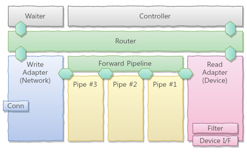
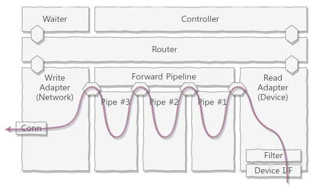
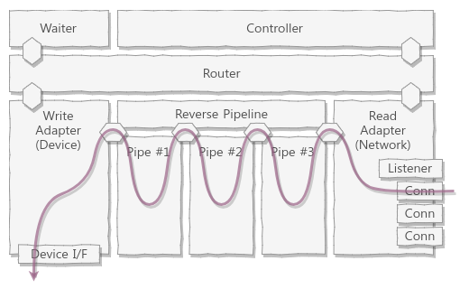
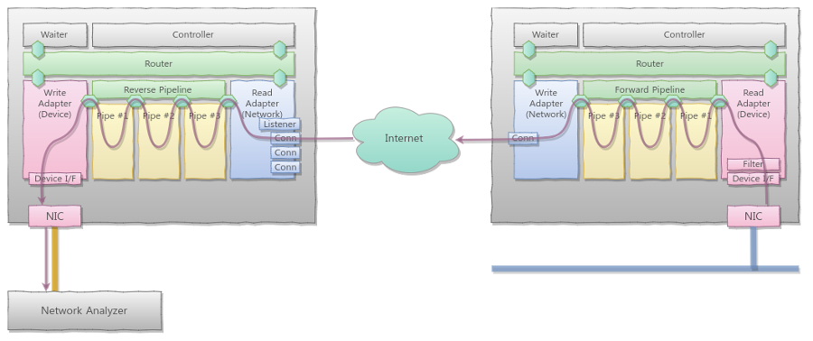
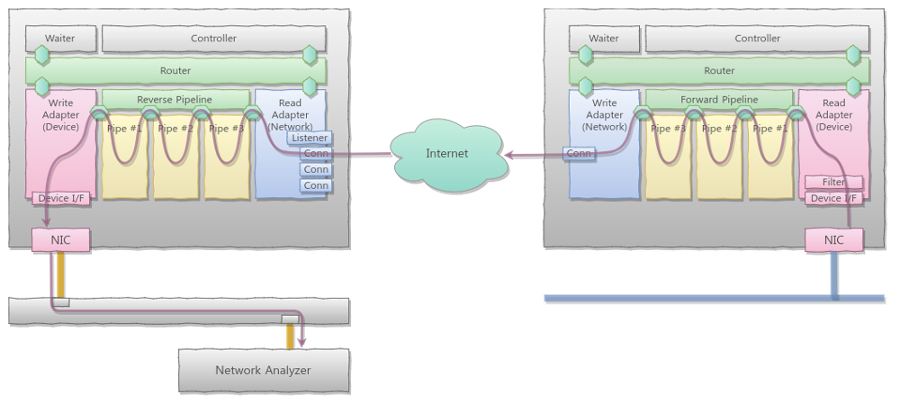
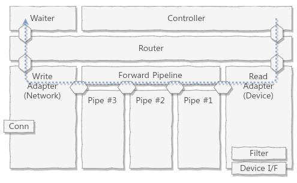
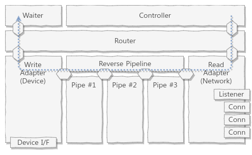

# Goul, Virtual Port Mirror over Internet (for Cloud)

[](https://pkg.go.dev/github.com/hyeoncheon/goul)
[](https://travis-ci.com/hyeoncheon/goul)
[](https://goreportcard.com/report/github.com/hyeoncheon/goul)
[](https://codeclimate.com/github/hyeoncheon/goul)
[](https://coveralls.io/github/hyeoncheon/goul?branch=master)
[](https://deepsource.io/gh/hyeoncheon/goul/?ref=repository-badge)


Goul(거울; Mirror in English) is a tool for virtual network port mirroring
over the Internet for network traffic analyze and/or security monitoring.
May useful especially for cloud computing environment.

On legacy infrastructure, with many physical switches, we can use a
[port mirroring](https://en.wikipedia.org/wiki/Port_mirroring)
([SPAN; Switched Port Analyzer](https://supportforums.cisco.com/t5/network-infrastructure-documents/understanding-span-rspan-and-erspan/ta-p/3144951)
in Cisco's term) on the
switch for monitoring and analyzing of traffic, and connecting a security
appliances. But in cloud computing environment, it is not easy as legacy
and in some cases, it is completely impossible.

This tool is for someone like me who want to mirror some port of the
virtual instances or virtual network appliances.

Goul is now on development using
[Go language](https://golang.org/)
with
[gopacket](https://github.com/google/gopacket)
and
[pcap library](http://www.tcpdump.org/pcap.html)
but not yet stable enough.


## Features

* Mirror one network device(port) from virtual instance to remote system.
* Selection of Rx, Tx or Both direction of traffic. (Plan)
* Packet filtering based on pcap library's rule.
* Pipelining for filtering, buffering, compression, deduplication, and more.
* Use TCP/IP for transmission over the Internet.
* Support adaptive mode to reduce the impact of production traffic. (Plan)


## Architecture

Goul is a set of library and its default executable. The executable `goul`
is a program written with goul library ofcause.

### Goul Library

### Goul Executable

**Goul consists of
[Controller](#controller-details),
[Processing Router](#router-details),
[Read/Write Adapters](#adapter-details),
and
[Pipes](#pipe-details).**
In conceptual structure, The Read Adapter is positioned on one edge of
the frame and Write Adapter is located on the other side.
Between them, the Processing Router is located and it contains some Pipes.
For controlling of them, the Controller is positioned on top of them.
It is easier to understand this with diagram:



Goul can be executed as both server mode and client mode. The diagram above
is for client mode of Goul.
The Read Adapter for client is Device Adapter and it is located on right
bottom of the frame (red box). By the Read Adapter, Forward Pipeline,
the virtual component of the Router is positioned with Router (green boxes)
and it has three Pipes from #1 to #3 (yellow boxes).
On left bottom, Network Adapter, the Write Adapter for client is located
(blue box). All of them are covered with Controller finally.
With this straight pipeline formation, Device Adapter works as a source of
the pipeline and Network Adapter will be a sync of the pipeline.


In server mode, next diagram, basic structure is same as client but
there are two differences. The first one is the Adapters. **Since Goul
works as receiver and packet injector in server mode**, the Read Adapter
is configured with Network Adapter and the Write Adapter is configured
with Device Adapter.
Second is the order of Pipes. As you can see on the label of pipeline,
we call it Reverse Pipeline in contrast to Forward Pipeline of client,
**the order of Pipes is reversed in server mode**. #3, #2 and #1


## Data Flow

### Client Mode

When the Goul started, it setup Router with Adapters and Pipes.
In client mode, Read Adapter initializes network interface device for
packet capture and Write Adapter makes a connection to the server
while setup.  When Goul executes Router, Router executes Adapter's
reader function and writer function, and Pipe functions internally
then all these functions will start their own loop as goroutines.

When the reader loop read packets from the network interface device,
the packets are passed into the Processing Router via channel.
Bundled executable uses the default Pipeline Router as a Router so
the packets are pushed into the Forward Pipeline (Actually the input
channel of the first Pipe).
Pipeline Router is a chain of the Pipes. Each Pipe has its own loop
for the processing of incoming data such as compression, counting,
deduplication, and so on.
The output of the Read Adapter is always a packet data but since some
of Pipes are used for modifying the packet data, for example compress
it with zlib or gzip, the data type on the pipeline can not be
specified as single format (See [Router Details](#router-details)).
Another end of the pipeline is connected to Write Adapter's writer
function and it receives data from the pipeline then just send it to
the connected server.

Diagram below diagram shows this client flow:




### Server Mode

As you can imagine, the data flow of the server mode also as same as
client since it just a mode, with same structure.
When Goul runs as server mode, it makes a listner for the connections
from clients, and initialize network device for packet injection.
If a client was connected, It invoke separated goroutine for each
connection but using same pipeline and writer for all of clients.

As already said, second difference of server mode is the order of the
Pipes. With same reason, the data type from reader to the end of the
pipeline can not be specified but the input data to the writer function
is packet data. Note that, the order of the Pipes are very important
for Pipeline Router. This Router is just a simple ORDERED stack of
the functions. Even though I write the Pipes carefully with exception
handling for the data type, it can be broken if you use custome Pipe
without this consideration.

Flow of the server side is shown in this diagram:



Yes, Quite simple!


## All Together Now

In [Data Flow](#data-flow) section, we just show the data flow inside of
the Goul program, for client mode and server mode.
Now "Calling All Engines" and say "All Together Now!"

Let say there is a virtual network appliance on the cloud environment
and we have network analyzer on the on-premises data center. In below
configuration, the right side is the cloud environment with running
instance of Goul in client mode and the left side is the on-premises
with network analyzer and running Goul in server mode.



The packets on the cloud network (thick blue line on right bottom)
should be readable by the NIC on the client for this works.
(Yes, sometimes we need Promiscuos mode or the box contains the client
must be a router or similar phase.)
After captured and processed, the packet on the blue line will be
sent via the Internet and it will be received by server. Server will
process it back and inject the packets into the network interface
that connected directly to the network analyzer.
As a result, even though the network analyzer cannot see the packets
on the blue line directly, all of the packets can be analyzed by the
analyzer.

Sometime, No. In most cases, the network analyzer is not dedicated
device for this target network. In this case, we can configure our
environment like below:



In this case, we use additional physical switch to make it as hub of
the analyzing. If the switch was configured well as mirror or dummy,
the packets from the top port which is connected to the server can be
found on the bottom port which is connected to the network analyzer.

Simple too!


## Router Details

Processing Router is a set of processing units which controls data processing
such as compression, deduplication, and other required processing.
In perspective of abstraction, the Router has only two channels. The input
channel and output channel. Input channel is the output channel of the
Read Adapter and output channel is the input channel for the Write Adapter.
With this abstracted interface rules, the internal of the Router can be free.

The default Router for the Goul is Pipeline Router. This requires right
order of the Pipes for forward pipeline of client and reverse pipeline
of server. Original design of the Router is that it handles MIME type
of the data passed between Pipes and automatically find right Pipe for
the data type with MIME but it is not easy to implement (since we need
to know not only the input type of the Pipe but also the output type,
and type of the final goal too.) and the effect of the real routing is
not big as I expected at the first time.

Anyway, user can implement their own Router with the interfaces.


## Pipe Details

Writing a Pipe also very easy. The interface for the pipe is very few
and simple. Currently gzip and zlib compression/decompression, packet
counting and printing for debug are included in the library.

Prefered candidates are packet counting with packet types for statistics,
discard some protocol on air, deduplication of the packet, and so on.
Note that protocol or port based filtering is supported by gopacket
library itself and it can be passed to Goul as command line arguments.


## Adapter Details

Adapter is most important part of the Goul. Everything is started from
Adapter and is finished with Adapter. There is two types of Adapters
and they must be provided to Router before run it.

Read Adapter is a Adapter for reading data from its own input source.
For example, the Read Adapter of client is Device Adapter as I already
mentioned. It reads packet data from configured network interface and
push it into the pipeline.
Like this, Read Adapter is used as source of the pipeline.

Write Adapter is a Adapter for writing given data to its destination.
For example, the Write Adapter for the server also Device Adapter and
it write(inject) given packet into the target device.
Yes, Write Adapter is used as sync of the pipeline, ofcause.


## Controller Details

Controller for the Goul was planed but currently not implemented.
Currently, just a simple interrupt handler is used as controller for
terminate Goul gracefully. If Goul receives interrupt signal, the
signal number 2 in linux and similar, the controller catch it and
send a termination message to the router via control channel
(In fact, it just close the channel now but the fine controll can
be implemented).

Diagram below shows the propagation of the termination message:

#### Client Mode



#### Server Mode




## Installation

Installation of Goul is same as any Go programs. Just get it.
But while compiling it, it needs `libpcap` development packet so you need
to install it before get. Below is the installation process for Ubuntu
Linux. (Or other Debian based Linux distributions)

```console
$ sudo apt-get install libpcap-dev gcc
<...>
$ go get github.com/hyeoncheon/goul/cmd/goul
$
$ ls $GOPATH/pkg/linux_amd64/github.com/hyeoncheon
goul  goul.a
$
$ ls $GOPATH/bin
goul
$
```


## Running

Goul was wrote as can support 2x2 mode.
It means, the server can be both a capturer and injector, the client
also can be a capturer and injector. with this, we can configure
our environment eaily even if there is a very complex firewalls
in front of the receiver(injector).
So called reverse connection mode: server do capture on the interface
of its device and wait for connection then send it to the connected
client which can act as receiver/injector.

Currently, I removed those codes for 2x2 mode because it makes the code
is not readable sometime and the chance to use this reverse connection
mode is rare. Most important reason for this decision is, it is
harder to implement multi-session receiver for multiple sources.

For the complex firewall environment, I have a plan of proxy mode.
To be continued...

Anyway,

Command line options for version 0.2 are shown below:

```console
$ ./goul --help
goul 0.2-head

goul is a packet capture program for cloud environment.

If it runs as capturer mode, it captures all packets on local network
interface and sends them to remote receiver over internet.
The other side, while it runs as receiver mode, it receives packets from
remote capturer and inject them into the interface on the system.

Usage: goul [-DhlsTv] [-a value] [-d value] [-p value] filters ...
 -a, --addr=value  address to connect (for client)
 -D, --debug       debugging mode (print log messages)
 -d, --dev=value   network interface to read/write
 -h, --help        help
 -l, --list        list network devices
 -p, --port=value  tcp port number (default is 6001)
 -s, --server      run as receiver
 -T, --test        test mode (no injection)
 -v, --version     show version of goul
$
```

Command for server mode is:

```console
$ sudo ./goul --server
<...>
```

Command for client mode is:

```console
$ sudo ./goul --addr 10.0.0.1
<...>
```

10.0.0.1 is a IP address of the server.
Note that, for both server and client, you need super user permission
to handle network interface devices. use sudo for it on command line.

If you cannot use default port number 6001 with any reason, simply
pass `-p #` or `--port=#` for assigning user defined port. `#` is the
number of the port to listen or connect.

Default device to capture or injection is `eth0`. but I know in most
cases, it need to be overrided. Use `-d dev` or `--device dev` option
for your device configuration.
If you don't know which devices are exists or configured on the
system, use `-l` or `--list`for listing all devices. Root privilege is
not requires for this.

```console
$ goul -l

Devices:
* eth0
  - IP address:  10.0.0.2
  - IP address:  fe80::465:0000:0000:40000
* eth1
  - IP address:  192.168.0.2
  - IP address:  fe80::4a8:0000:0000:0000
* any
* lo
  - IP address:  127.0.0.1
  - IP address:  ::1
$
```

The Goul is currently on development and it can be unstable. So if you
just want to test it without real packet injection, use `-t` flag.
It allows receiver runs in testing mode then it does not inject but
just display the number of packets it received.

Along with `-t` flag, `-D` flag is useful for testing. It turns Goul in
verbose mode and it print out a lots of messages while running.

Please note that, The Goul's default capturing filter is `ip`. so it
just ignore all non-IP protocols including L2 level protocols.
If you want to set more specific filter, you can put it in the end of
the command line. (`filters ...`) The filter rule is same as other
`pcap` based application like `tcpdump`. So you can set
`port 80 and port 443` as filter for getting `HTTP` and `HTTPS` traffic.


Have fun with packets! and funnier with the Goul!


## Current Status

* Support simple capturing and injection of packet over the Internet.
* Currently all compression features are disabled by default.
  * I found that it consumes CPU but the compression ratio is not effective.
* Currently Pipeline configuration from command line is not supported.


## Caution!!!

THIS PROGRAM IS WORKING WITH LOW LEVEL NETWORKING FEATURES. DO NOT USE THIS
PROGRAM IF YOU DO NOT UNDERSTAND WHAT IT DOES.

ESPECIALLY, DO NOT FORWARD L2 MANAGEMENT PROTOCOL LIKE `STP` INTO THE NORMALLY
CONFIGURED PORT. IT CAN BREAK YOUR ENTIRE NETWORK.


## Author

Yonghwan SO https://github.com/sio4, http://www.sauru.so


## Copyright (GNU General Public License v3.0)

Copyright 2016 Yonghwan SO

This program is free software; you can redistribute it and/or modify it under
the terms of the GNU General Public License as published by the Free Software
Foundation; either version 3 of the License, or (at your option) any later
version.

This program is distributed in the hope that it will be useful, but WITHOUT
ANY WARRANTY; without even the implied warranty of MERCHANTABILITY or FITNESS
FOR A PARTICULAR PURPOSE. See the GNU General Public License for more details.

You should have received a copy of the GNU General Public License along with
this program; if not, write to the Free Software Foundation, Inc., 51
Franklin Street, Fifth Floor, Boston, MA 02110-1301 USA

