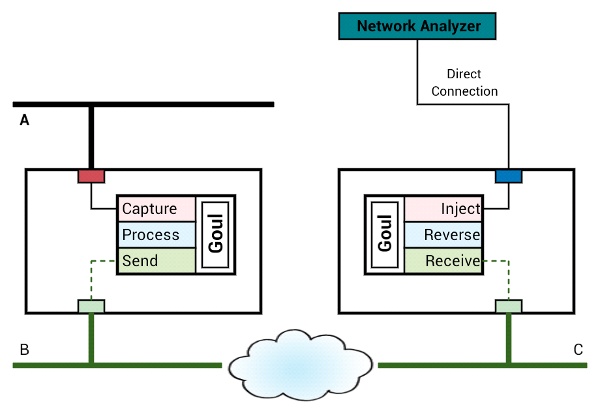

# Goul, Virtual Port Mirror over Internet (for Cloud)

Goul(=Mirror in Korean: 거울) is a tool for virtual network port mirroring
over the Internet, especially for cloud computing environment.

With legacy infrastructure, with many physical switches, we can configure
a mirror port(SPAN) on the switch for network monitoring, analysis, and
connecting a security appliances. But in cloud computing environment, it
is not easy as legacy and in some cases, it is completely impossible.

This tool is for someone like me who want to mirror some port of the
virtual instances or virtual network appliances.

It is now on development using
Go language
with
gopacket
and
pcap
library.

## Features

* Mirror one network device(port) from virtual instance to remote system.
* Selection of Rx, Tx or Both direction of traffic.
* Packet filtering based on pcap library's rule.
* Pipelining for filtering, buffering, compression, deduplication, and more.
* Use TCP/IP for transmission over the Internet.
* Adaptive mode to reduce the impact of production traffic.

## Work Flow

Goul captures packets on the source device with reader function and push it
into processing pipeline.  Processing pipeline is a chain of pipe functions
executed as a goroutine.  Another end of the pipeline is connected to writer
function and it send the data to the receiver side, over the Internet.

The pipe function is a function with input and output channel. The input
data and output data is usally a packet data but some pipe can modify the
packet into different kind of binary. (for example, gzip compressed data)
You can write your own pipe function with this interface for your own
reason. for example, counting specific packets, discard some protocol,
or deduplication of the same packets.

In the receiver side, which is the Goul is running as receiver, the reader
function receives all data from network socket, which is connected to the
sender via Internet. It pushs the data into the reverse pipeline.
The reverse pipeline is also a chain of pipe functions as same as processing
pipeline but reverse order of it. (because the datatype must be matched by
the stacked pipes)

The reverse pipeline recovers the packet into its original form and pass
it to the writer function. Writer function for the receiver mode is packet
injector. After that, the packets on the network interface is virtually
same as original source device. (Simply, "Copied")

In above configuration, the packets captured on network `A` will be passed
through the process pipeline on left side, then sended to the right side
over the Internet. In the right side, the receiver reverse it(for example
decompressing it,...) and inject into a local network interface.

The target network interface is connected to the switch port which is
configured as source port of the mirror configuration set. The packet on
the source port will be mirrored by switch configuration and then it passed
into Network Analyzer.

If the network to be monitored is simply, or the analyzer is dedicated to
this set, then you can configure it as below. the only difference is, there
is no switch for mirroring. The Network Analyzer is directly connected to
the receiver server.

### Pipeline Details

You can write your own pipe function with input and output channel.
There is no limitation on the job of the function. (Currently, the packet
already contains these functions: zlib and gzip compression and its reverse,
counting, and printing the packet details for debugging.)

The pipe function must be wrote as a pair: compress then decompress as reverse,
encoding then decoding as reverse, and so one. Exception for this rule is a
transparent function which is the output data is same as its input data.
For example, Counter or packet printer is a transparent function.

If the function used in process pipeline is not transparent one, then the
reverse function must be exist on the receiver side.

## Current Status

* Just started to develop basic structure.

## Caution!!!

THIS PROGRAM IS WORKING WITH LOW LEVEL NETWORKING FEATURES. DO NOT USE THIS
PROGRAM IF YOU DO NOT UNDERSTAND WHAT IT DOES.

ESPECIALLY, DO NOT FORWARD L2 MANAGEMENT PROTOCOL LIKE `STP` INTO THE NORMALLY
CONFIGURED PORT. IT CAN BREAK YOUR ENTIRE NETWORK.

## Author

Yonghwan SO https://github.com/sio4, http://www.sauru.so

## Copyright (GNU General Public License v3.0)

Copyright 2016 Yonghwan SO

This program is free software; you can redistribute it and/or modify it under
the terms of the GNU General Public License as published by the Free Software
Foundation; either version 3 of the License, or (at your option) any later
version.

This program is distributed in the hope that it will be useful, but WITHOUT
ANY WARRANTY; without even the implied warranty of MERCHANTABILITY or FITNESS
FOR A PARTICULAR PURPOSE. See the GNU General Public License for more details.

You should have received a copy of the GNU General Public License along with
this program; if not, write to the Free Software Foundation, Inc., 51
Franklin Street, Fifth Floor, Boston, MA 02110-1301 USA

